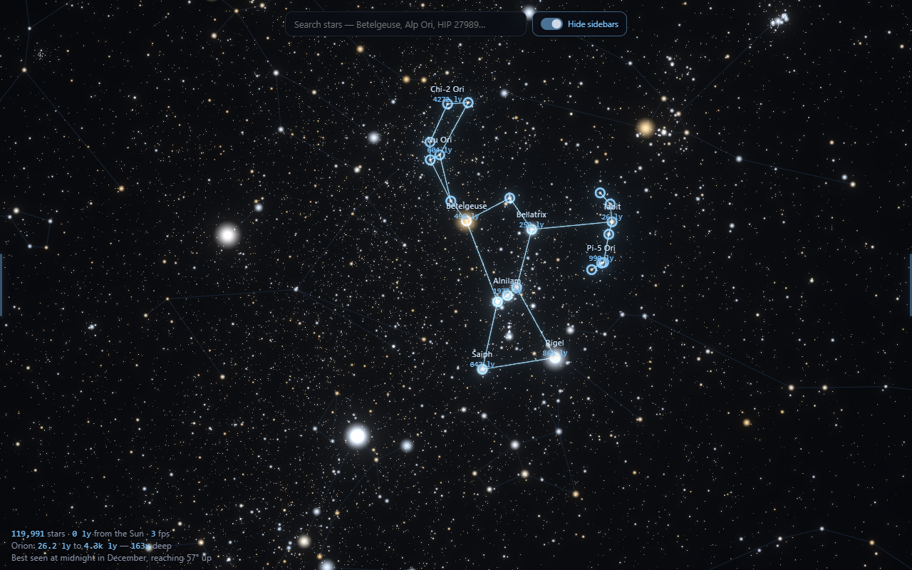
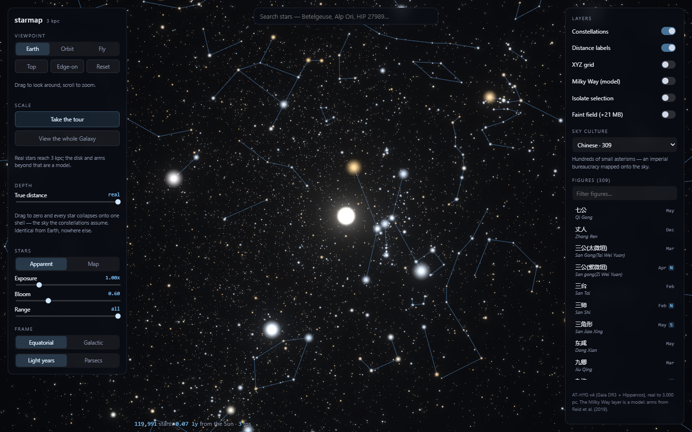
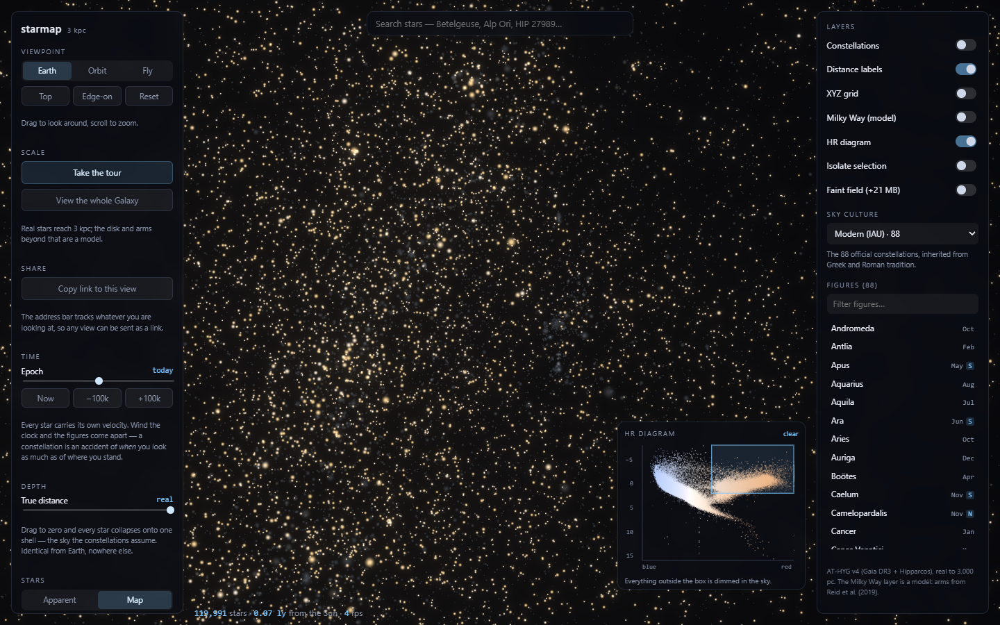
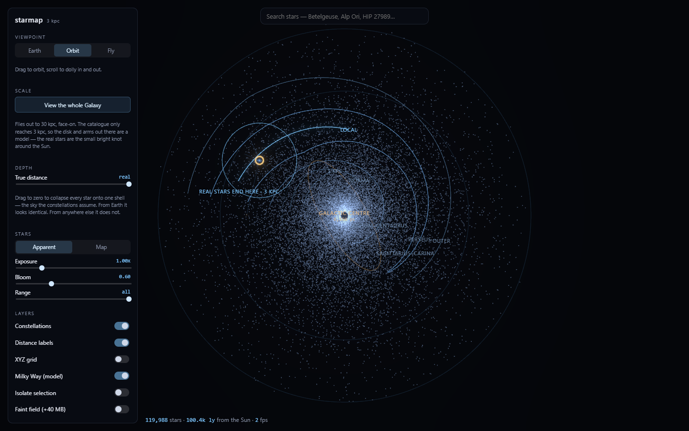
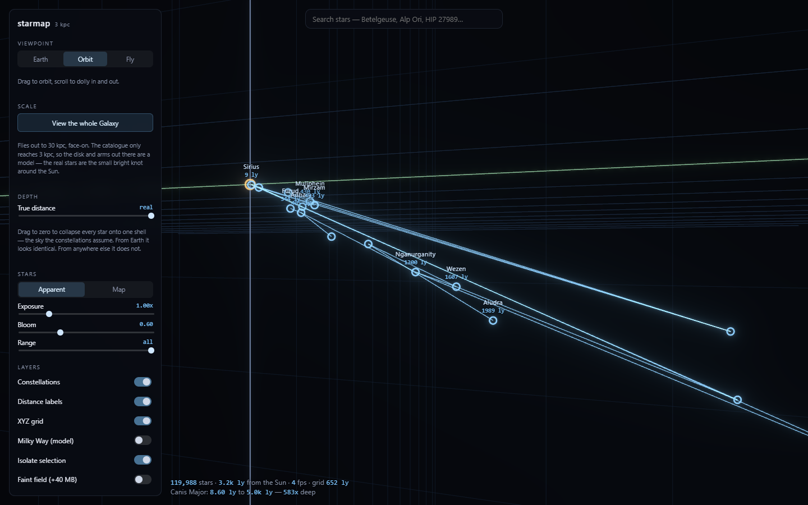
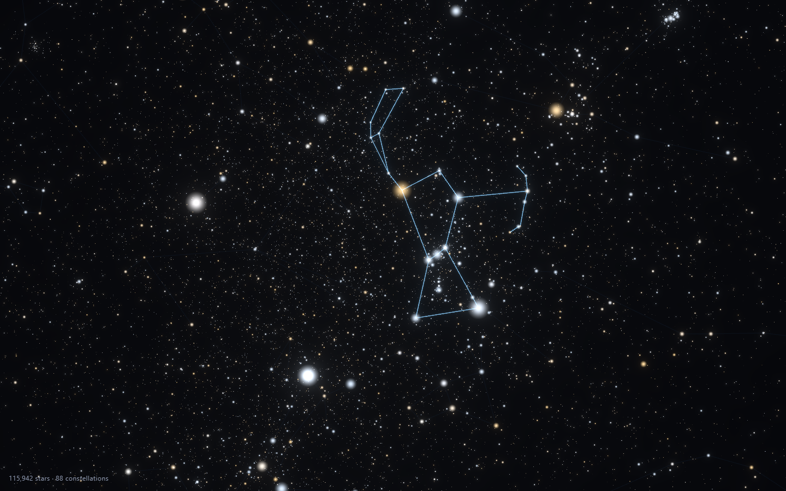
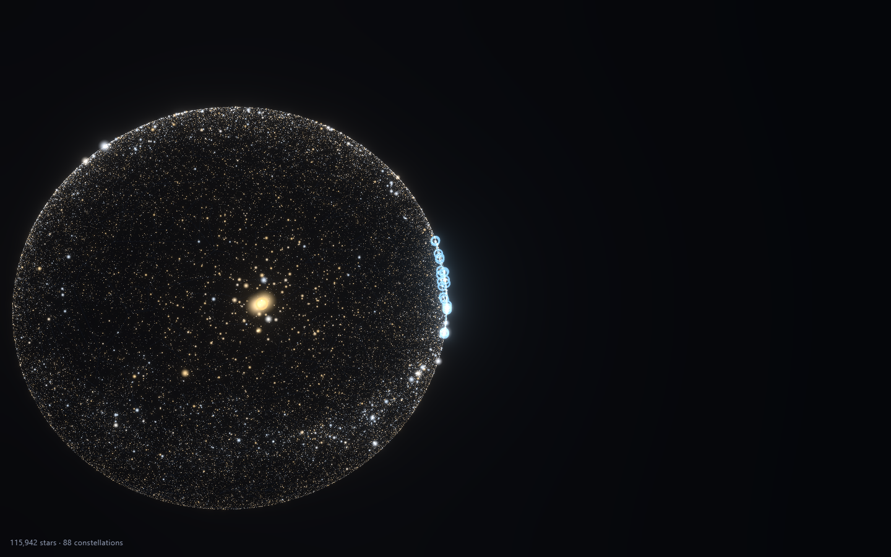

# starmap

**[Live map →](https://shaunak3000.github.io/starmap/)**

A 3D map of every catalogued star within 3,000 parsecs of the Sun, set inside a
modelled Milky Way, built to make one thing obvious: **constellations are an
accident of where we happen to stand.**

From Earth, Orion is a hunter. Fly a few hundred light years sideways and it is
nothing at all — its stars turn out to be scattered from 26 to 1,977 light
years away, with no relationship to each other beyond sharing a line of sight.



First-time visitors get a **60-second guided tour** — the Earth sky, Orion's
figure, the same stars seen side-on as the hunter falls apart, then out to the
Galaxy. It autoplays once (never against `prefers-reduced-motion`), stops the
instant you touch anything, and hands over the exact view it was mid-shot on,
because its steps write to the same store the controls do. "Take the tour"
replays it.

## Jump straight in

Every view has a link, so these open exactly where they say — no clicking
around first:

- [**Orion, revealed side-on**](https://shaunak3000.github.io/starmap/#fig=Ori&cam=orbit,18.5,190.09,26.24,501.214,4.6154,0,60)
  — the hunter, seen from off Earth's line of sight
- [**Canis Major, alone**](https://shaunak3000.github.io/starmap/#fig=CMa&cam=orbit,-84.24,316.47,-144.85,931.032,4.9725,0,60&on=i)
  — Sirius at 9 light years, Aludra at 1,989
- [**The Chinese sky**](https://shaunak3000.github.io/starmap/#cul=chinese&cam=earth,0,0,0,0.02,3.1416,0,60)
  — the same stars, 309 figures instead of 88
- [**The Indian nakshatras**](https://shaunak3000.github.io/starmap/#cul=indian&cam=earth,0,0,0,0.02,3.1416,0,60)
  — the sky divided by the Moon's path rather than into pictures
- [**Our place in the Milky Way**](https://shaunak3000.github.io/starmap/#cam=orbit,-447.24,-7118.51,-3943.26,29999.975,1.7952,-0.4735,60&on=w)
  — the Sun on the Local Arm, 8.15 kpc out
- [**The sky the constellations assume**](https://shaunak3000.github.io/starmap/#fig=Ori&cam=orbit,18.5,190.09,26.24,501.226,4.6154,0,60&dep=0)
  — every star collapsed onto one shell

`npm run make:links` regenerates these by driving the real app and reading back
the hash it wrote, so none of them is a link nobody has opened.

## What it does

- **2.5M stars** from AT-HYG v4 (Gaia DR3 astrometry, with Hipparcos filling the
  bright end Gaia saturates on), rendered as a GPU point cloud.
- **Four sky cultures** over the same stars — modern (88 figures), Chinese
  (309), Indian nakshatras (50) and Arabic al-Sufi (51) — joined to the
  catalogue by HIP number and drawn at their stars' true 3D positions. Swap
  culture and the sky reorganises completely: the figures are a cultural
  artefact, not a property of the sky.
- **Season and hemisphere** for every figure, derived from its own stars: the
  month it transits at local midnight, its transit altitude from mid-northern
  and mid-southern latitudes, and whether it is circumpolar or never rises.
- **Three viewpoints.** Earth POV is a planetarium locked to the Sun. Orbit
  circles any star or figure. Fly is free movement through the volume.
- **A depth slider** that collapses every star onto a single shell — the sky the
  constellations implicitly assume — and expands it back to reality.
- **A modelled Milky Way** for galactic context, with our 3 kpc bubble of real
  data drawn to scale inside it.
- **An adaptive XYZ grid** that resnaps its spacing from parsecs to kiloparsecs
  as you zoom, and an isolate mode that strips the view to one figure.
- **Star inspection**: click any naked-eye or named star for distance,
  magnitudes, temperature and spectral class.
- **A time scrubber**, ±100,000 years. Every star carries its own space
  velocity, so winding the clock pulls the figures apart — a constellation is an
  accident of *when* you look as much as of where you stand.
- **A brushable HR diagram.** Drag a box around the giant branch or the main
  sequence and everything outside it dims in the sky, so a population picked out
  by physics can be seen in space.
- **Shareable views** — the address bar tracks culture, figure, camera, layers,
  frame and epoch, so any view can be sent as a link and survives a refresh.

### The same stars, other people's sky



Nothing about the stars changed — only who was looking. Where the Western set
draws a hunter, the Chinese set draws hundreds of small asterisms; the Indian
nakshatras divide the sky along the Moon's monthly path instead. Names are shown
in their own script with romanisation, and each figure carries the month it is
best seen and which hemisphere can see it.

### Selecting a population by physics



Colour index across, absolute magnitude up. The main sequence and the giant
branch separate on their own — nothing here is drawn, it is 120,000 real stars
plotted by two of their own measurements. Brushing the giants leaves only the
evolved stars lit, and the sky turns gold.

### Where we actually are



The Sun sits 8.15 kpc from the Galactic Centre, on the Local Arm, with Perseus
outside us and Sagittarius–Carina within. The small ringed circle is the edge of
the real catalogue — everything beyond it is model, and the app says so.

### One figure, alone



Isolate mode drops everything except the selection. Canis Major runs from Sirius
at 8.6 light years to a member 5,000 light years out: **583× deep**, and utterly
meaningless as a shape from anywhere but here.

### The sky as we see it

Earth POV reproduces the real sky. Orion here matches any star chart —
Betelgeuse orange at the shoulder, the belt, Rigel at the foot.



### The sky the constellations assume

Pull the depth slider to zero and every star collapses onto one shell. Seen
from the Sun this is *indistinguishable* from the real sky — which is precisely
why the constellations survived for millennia. Seen from outside, it is a
hollow ball with us at the centre.



## Running it

```bash
npm install
npm run data     # downloads ~190 MB, packs the binary tiers (one time)
npm run dev
```

`npm run data` fetches AT-HYG and the four Stellarium sky cultures into `data/raw/`,
then writes binary tiers into `public/catalog/`. Both directories are
gitignored and fully reproducible.

```bash
npm test             # unit tests
npm run check:camera # drives real pointer/wheel input at a running dev server
npm run check:links  # proves a shared link restores the view it captured
npm run build        # production bundle
```

## Deploying

Pushing to `main` deploys to GitHub Pages via `.github/workflows/deploy.yml`:
test, build with `BASE_PATH=/starmap/` so assets resolve under the project-site
subpath, publish.

**The packed tiers in `public/catalog/` are committed**, so a deploy contacts no
third-party host. They are generated files, which normally argues for building
them in CI — but the upstream AT-HYG filename already changed once during this
project (v3.3 → v4.0, and that repo keeps "only 1 major set of data files"), and
a moving URL would silently break every future deploy. 25 MB in git buys
immunity to that. Regenerating is a deliberate local step:

```bash
npm run data     # re-download, repack, then commit the result
```

Only `data/raw/` (the ~190 MB source download) stays gitignored.

## How it is put together

**Data pipeline** (`scripts/`) — streams 2.5M catalogue rows, keeps the 1.9M
with usable distances inside 1000 pc, and packs them into three tiers by
magnitude so the app can show something immediately and stream the rest:

| tier | stars | precision | size | contents |
| --- | --- | --- | --- | --- |
| `t0.bin` | 8,351 | float32 | 0.27 MB | naked-eye and named, with metadata |
| `t1.bin` | 111,640 | float16 | 1.7 MB | down to magnitude 9 |
| `t2.bin` | 2,378,330 | float16 | 22.7 MB | the faint field, loaded on demand |

t0 and t1 also carry a space velocity per star, in a parallel block so the
interleaved record never widened. The faint field deliberately does not: an
individual haze star cannot be seen moving, and carrying it would have added
15 MB to the largest asset in the project.

Only `t0` is read by the CPU — picking, constellation geometry, search and the
star card all index into it, and it holds the stars you fly to and quote
distances for, so it stays full precision. The bulk tiers are never touched
outside the GPU, so they ship as half floats and upload as `HALF_FLOAT`
attributes; the shader is identical either way.

Half floats suit this data because their error is *relative*: Proxima lands
within 0.0006 pc, a star at the 3 kpc edge within about 1.5 pc — well inside the
parallax uncertainty out there. Fixed-point over the same range would put the
error budget in exactly the wrong place. There is also no per-star id array:
nothing read one, and for the faint field it was 9 MB of dead weight. Together
those took the catalogue from 58 MB to 25 MB.

Positions are recomputed from RA/Dec/distance rather than trusting the
catalogue's own cartesian columns; the two agree to 1.3e-4 pc across all 2.5M
stars, which is the pipeline's main correctness check.

Stars anchoring a constellation are kept even when they fall outside 3,000 pc —
otherwise Orion loses a shoulder. That guarantee applies to the **union** of all
four cultures' stars (1,718 of them), not just the Western set; adding three
cultures grew t0 by only 59 stars, because their figures are drawn from bright
stars that were already there.

**Why the cut is at 3 kpc.** It is where Gaia's parallaxes stop being
defensible for ordinary stars. The catalogue's own distance histogram shows the
cliff:

| shell | stars |
| --- | --- |
| 0 – 1,000 pc | 1,885,860 |
| 1,000 – 2,000 pc | 515,921 |
| 2,000 – 3,000 pc | 96,537 |
| 3,000 – 5,000 pc | 28,557 |
| 8,000 – 10,000 pc | 631 |

That collapse is the survey running out of precision, not the Galaxy ending. At
the Galactic Centre's distance the catalogue holds a few hundred stars against a
few hundred billion real ones — which is exactly why galactic structure has to
be modelled rather than plotted.

**Galaxy model** (`src/lib/galaxy.ts`) — the spiral arms are not invented. They
are the log-periodic fit of Reid et al. (2019), derived from VLBI trigonometric
parallaxes of ~200 high-mass star-forming regions, evaluated as
`ln(R/R_kink) = -(β - β_kink) tan ψ` with the paper's per-arm pitch angles and
kinks. The disk haze, bar and radius rings are schematic. The whole layer is
styled as cold thin lines so it never reads as catalogue data.

**Rendering** (`src/scene/`) — one interleaved GPU buffer per tier, five floats
per star. Apparent-magnitude mode computes brightness per-vertex from the
camera's actual distance, so stars genuinely brighten as you approach. Sub-pixel
stars shed their surplus area into brightness instead of clamping to a uniform
speck, which is what keeps the faint majority from becoming grey haze.

**Camera** (`src/scene/CameraRig.tsx`) — all three modes are one
parameterisation, `position = target − dir(yaw, pitch) × distance`. Earth POV is
distance 0 at the Sun; fly is distance 0 with a movable target. Because the
modes differ only in which inputs are live, switching between them is
algebraically continuous. Dolly and travel interpolate in log space so one
wheel notch covers the same *ratio* of distance at 0.1 pc as at 30 kpc, and the
dolly is exactly reversible. Wheeling zooms toward the cursor rather than the
orbit centre; right- or shift-drag pans; Top / Edge-on / Reset jump to canonical
angles relative to whichever reference frame is active.

Rotation follows the universal convention that whatever you grab tracks your
mouse. The arithmetic differs by mode — orbit swings the camera *around* a
target, so moving it right pushes the scene left, while Earth POV pivots in
place and pulls the scene right — which is exactly the kind of sign that is easy
to get backwards in one mode and not notice.

`npm run check:camera` drives real pointer and wheel events at the running app
and asserts what the viewer sees move, since screenshots cannot show whether
navigation works. Orbit is checked on the camera's own displacement rather than
a marker: orbiting sweeps a point at target depth sideways whichever way you
drag, so a marker test passes just as happily with the sign inverted.

## Caveats worth knowing

- **Supergiant distances are soft.** Gaia's parallaxes degrade for the most
  luminous stars, which are exactly the ones anchoring famous figures. HIP 54463
  in Carina is catalogued here at 4,489 pc against a literature range of roughly
  1.5–2.9 kpc. The app shows what AT-HYG says rather than second-guessing it.
- **The catalogue is magnitude-limited.** At 3,000 pc only intrinsically bright
  stars appear, so the outer volume is genuinely sparser than reality.
- **The Galaxy layer is a model, not data.** Arm geometry comes from a published
  fit; the disk haze is a synthetic exponential disk standing in for a
  population the catalogue cannot see. Nothing in that layer is a measurement of
  an individual star.
- **Constellation figures are one culture's.** These are Stellarium's modern
  Western set. They are a convention, not data — which is the point.

## Sources

- [AT-HYG v4](https://codeberg.org/astronexus/athyg) — Astronomy Nexus, CC BY-SA.
  Merges Gaia DR3, Hipparcos, Tycho-2, Yale Bright Star and Gliese.
- [ESA Gaia DR3](https://www.cosmos.esa.int/gaia) — CC BY-SA 3.0 IGO.
- [Stellarium](https://github.com/Stellarium/stellarium) modern sky culture
  (pinned to v25.3) for the constellation figures.
- Reid et al. (2019), *Trigonometric Parallaxes of High-mass Star-forming
  Regions: Our View of the Milky Way*, ApJ 885, 131
  ([arXiv:1910.03357](https://arxiv.org/abs/1910.03357)) — spiral arm fit and
  R₀ = 8.15 kpc.
